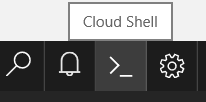
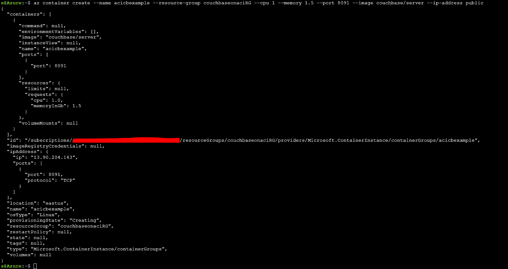
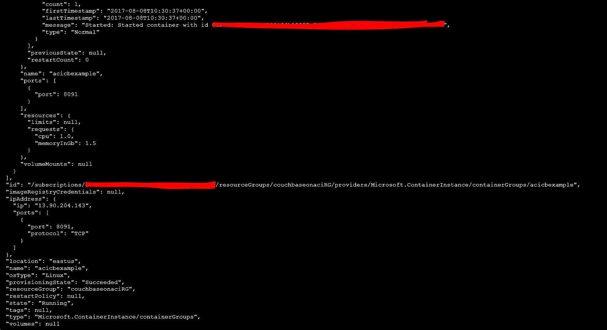
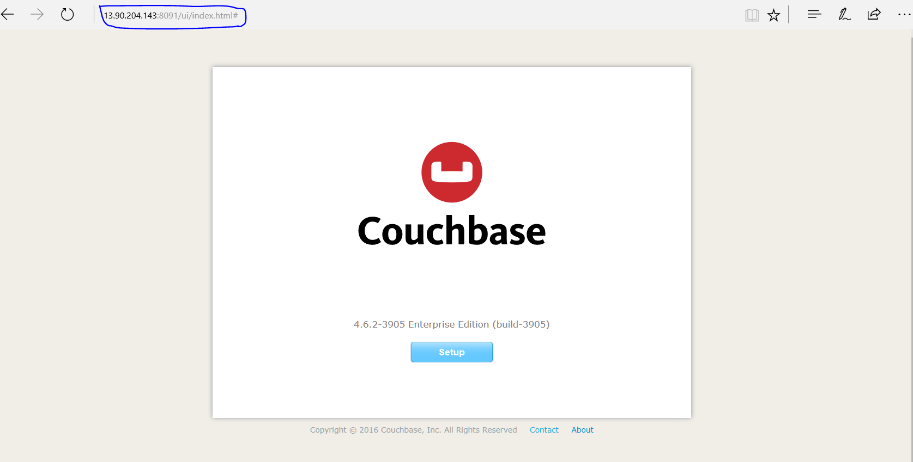
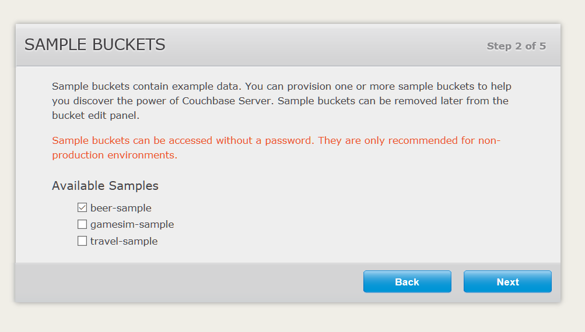
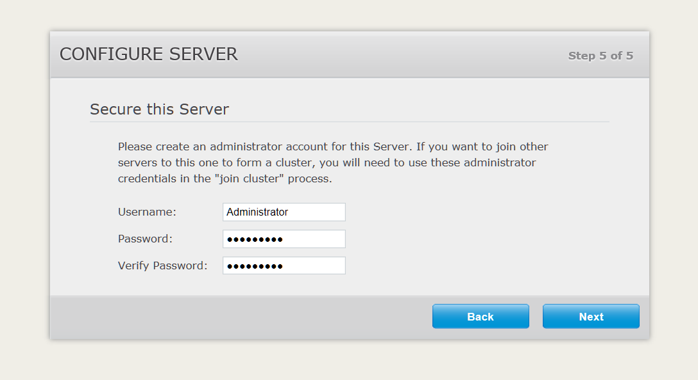
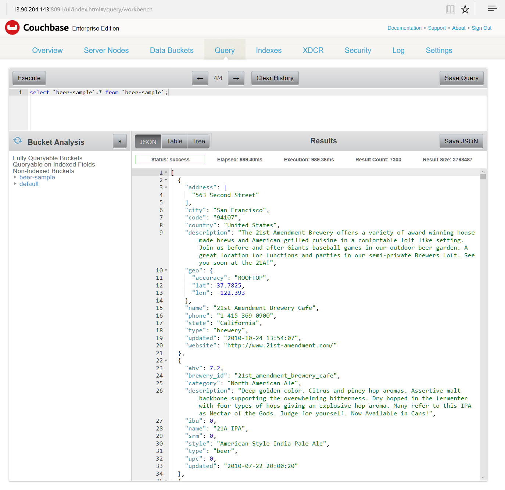

# Couchbase Cluster on Azure Container Instances (ACI)

These instructions describe how to set up a single node of Couchbase running in ACI.  It's not currently possible to setup multiple nodes of Couchbase in ACI because only a public NAT IP is available.  Once DNS names are available, multiple nodes will be possible.

## What are Azure Container Instances

ACI containers are conceptually similar to pods in Kubernetes.  While not truly orchestration, ACI
allows grouping around first-class container objects. The containers within the group can communicate with each other on a private network by default.  External communication is established via a randomly assigned public IP.

It is important to be aware that ACI is in preview and is not for production use.  

## Why use ACI

ACI allows you to easily run containers on Azure with a single command. There is no managing of Virtual
Machines and other infrastructure components. [Billing](https://azure.microsoft.com/en-us/pricing/details/container-instances/)
is based on number of cores and memory allocated.

## Prerequisites

* A Microsoft Azure account. Create an [account](https://azure.microsoft.com/en-us/free/) if required.

The [Azure Cloud Shell](https://docs.microsoft.com/en-us/azure/cloud-shell/limitations) is command-line for this example so that the Azure Portal can be used exclusively.



## Create a Resource Group
```
s@Azure:~$ az group create -l eastus -n couchbaseonaciRG
```
After successful creating the resource group the console prints the output:
```
{
  "id": "/subscriptions/XXXXXX-XXXX-XXXX-XXXX-XXXXXXXXXXXXX/resourceGroups/couchbaseonaciRG",
  "location": "eastus",
  "managedBy": null,
  "name": "couchbaseonaciRG",
  "properties": {
    "provisioningState": "Succeeded"
  },
  "tags": null
}
```

## Create an ACI using the Cloud Shell



The provisioningState specifies "*Creating*".

Wait about a minute then execute the container show command to make sure the instance has been provisioned successfully:

```
s@Azure:~$ az container show --name acicbexample -g couchbaseonaciRG
```
Pay attention to the port, IP and provisioningState (should be *"Succeeded"*).


We can begin starting the cluster by opening **http://\<IP\>:8091** in a web browser.



## Start the cluster via the Web Console

1. Select "*Start a new cluster*".
2. Set the "*Data RAM Quota*" and "*Index RAM Quota*" to 512 MB.
3. Leave the other fields as the defaults and hit "*Next*".
4. Choose the choose the "beer-sample" bucket and continue to hit "*Next*".
5. Continue to hit "*Next*" following the instructions.
6. On the final step enter a username and password for the administrator account.




The cluster is running, you will notice that you have one active server.

## Run a query

We will use data from the beer-sample bucket chosen during setup for a N1QL query:

1. Navigate to the "*Query*" tab.
2. Type "select `beer-sample`.* from `beer-sample`;" (without the quotes) in the query text box and hit "*Execute*".
3. Observe the results and explore the different output format tabs.



## Clean up
Tear-down is simply deleting the container using the command:

```
s@Azure:~$ az container delete --name acicbexample --resource-group couchbaseonaciRG --yes
```

Now we can do a check that the container is gone by the command:


The command returned nothing, which indicates the container no longer exists.

That is it!  We are finished.  Using ACI is that simple and easy.

## Notes on ACI

[Azure Container Instances (ACI)](https://azure.microsoft.com/en-us/blog/announcing-azure-container-instances/) are serverless Docker containers on Azure.  The [ACI connector](https://github.com/Azure/aci-connector-k8s) enables Kubernetes clusters to make use of ACI.

To setup the ACI connector run:
    git clone git@github.com:Azure/aci-connector-k8s.git
    cd aci-connector-k8s
    kubectl create -f examples/example-aci-connector.yaml

It's unclear to me how to point the operator at ACI.

The connector doesn't currently support secrets, so using ACI is not possible at this time.  We're going to have discussions to explore the roadmap here.
